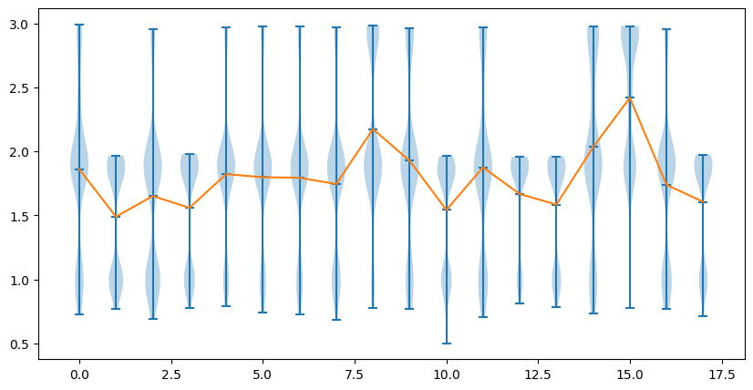
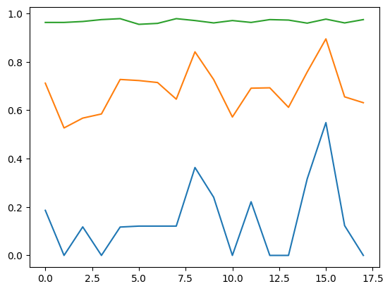

# 🤖 Reinforcement Learning of LLM Agents

This repository implements Grouped Relative Policy Optimization (GRPO) from [DeepSeekMath](https://arxiv.org/pdf/2402.03300) for training agentic LLMs with tool use capabilities. The implementation focuses on training a retrieval-augmented generation (RAG) agent using reinforcement learning.

## 🚀 Setup and Installation

### 📋 Prerequisites
- NVIDIA GPU with CUDA support
- Docker and Docker Compose
- At least 24GB of GPU memory for training
- At least 100GB of disk space

### 🔧 Environment Setup
1. Clone this repository
2. Download Qwen2.5-7B-Instruct model
3. Create QLoRA version of the model with `create_lora_model.py`
4. Pull and build docker images:
   ```bash
   docker pull vllm/vllm-openai:v0.7.2
   docker build -t grpo:dev .
   ```

## 🔄 Training Pipeline

### 1️⃣ Data Preparation
Run `data_prep.py` to prepare the dataset:

```bash
python data_prep.py
```

This script:
- Loads a medical QA dataset (MedQuAD by default)
- Scrapes web content from document URLs in the dataset
- Processes and chunks the documents
- Creates a searchable document store using ChromaDB and BM25
- Prepares the dataset for training

You can customize the data preparation by modifying parameters:
```python
dataset = load_or_scrape_documents(
    dataset_name="your_dataset",  # HuggingFace dataset name
    cache_dir="./dataset",        # Local cache directory
    content_dir="./document_content",  # Directory to store scraped content
    batch_size=100,               # Batch size for processing
    skip_existing=True            # Skip already processed documents
)
```

### 2️⃣ Creating a QLoRA Model
Before training, create a QLoRA version of the base model:

```bash
python create_lora_model.py
```

This script:
- Loads the base model (Qwen2.5-7B-Instruct)
- Quantizes it to 4-bit precision using BitsAndBytes
- Adds LoRA adapters to specific layers
- Saves the quantized model and LoRA configuration

### 3️⃣ GRPO Training
Run the GRPO training loop:

```bash
python grpo_train.py
```

Tmux is recommended for since the training can get quite long.

The training process involves:
1. 🎮 **Rollout Generation**: The agent interacts with the environment to generate trajectories
2. 🎯 **Reward Calculation**: Multiple reward functions evaluate the agent's performance
3. 📈 **Policy Optimization**: The model is updated based on the rewards

#### ⚙️ Training Parameters
Key parameters in `grpo_train.py`:
- `max_steps`: Number of training iterations
- `learning_rate`: Learning rate for optimization
- `batch_size`: Batch size for training
- `num_rollouts`: Number of rollouts per example
- `beta`: KL penalty coefficient

## 🔬 Technical Details

### 📚 Document Store and Retrieval
The system uses a hybrid retrieval approach combining:
- **Dense Retrieval**: Using E5 embeddings for semantic search
- **Sparse Retrieval**: Using BM25 for keyword matching
- **Fusion**: Combining both approaches with configurable weights

The `DocumentStore` class in `document_store.py` handles:
- Document chunking and processing
- Embedding generation
- Hybrid search functionality
- Result ranking and fusion

### 🎲 Rollout and Reward Functions
The `grpo_rollout.py` script implements:

1. 🔄 **Rollout Generation**: Generating agent trajectories using vLLM
2. 🏆 **Reward Functions**:
   - `get_mrr`: Mean Reciprocal Rank for retrieval quality
   - `get_answer_similarity`: Semantic similarity between model answer and ground truth
   - `get_format_reward`: Reward for following the correct output format

3. 🧮 **Reward Combination**: Methods for combining multiple reward signals:
   - Uniform weighting
   - Standard deviation-based weighting
   - PCA-based dimensionality reduction
   - L2 norm-based combination

### 🏗️ Training Architecture
The system uses a distributed architecture with Docker containers:
- **vLLM Server**: Serves the model for inference during rollouts
- **Rollout Container**: Generates trajectories and calculates rewards
- **Training Container**: Updates the model using DeepSpeed or FSDP

## 📊 Training Results Analysis

### 📈 Reward Distribution


The reward distribution plot shows how the rewards are distributed across different iterations of training

### 📉 Reward Progression


The rewards plot shows the progression of different reward components over training iterations:
- **Overall Reward** shows consistent improvement
- <b><span style="color:#89CFF0">MRR</span></b> 🟦 increases steadily, indicating better retrieval performance
- <b><span style="color:orange">Answer Similarity</span></b> 🟧 shows improvements but suffers from sudden drop
- <b><span style="color:green">Format Adherence</span></b> 🟩 stabilizes quickly, showing the agent learns proper output formatting early

These results demonstrate that GRPO effectively improves the agent's performance across multiple dimensions, with particularly strong gains in answer quality and retrieval accuracy.

## 🧩 Advanced Usage

### 🛠️ Custom Reward Functions
You can implement custom reward functions by adding them to the `get_reward_functions` dictionary in `grpo_rollout.py`.

### 🎛️ Hyperparameter Tuning
Key hyperparameters to tune:
- Learning rate
- Number of rollouts
- Beta coefficient (KL penalty)
- Reward weights

### 🔄 Model Merging
After training, merge the LoRA weights back into the base model:

```bash
python merge_lora.py --base-model /path/to/base --lora-model /path/to/lora --output-path /path/to/output
```

## 🔮 Next step
Reinforcement learning is expected to scale with sequence length, hence the need for a more efficient distributed training approach.
- ✅ DeepSpeed ZeRO 3
- 🔜 gradient checkpointing
- 🔜 context parallelism

Warm start reinforcement learning and / or improved test time sampling
- SFT before GRPO
- [rstar math](https://arxiv.org/abs/2501.04519)
- [reasonflux](https://arxiv.org/abs/2502.06772)
- [s1](https://arxiv.org/abs/2501.19393)
- [s*](https://arxiv.org/pdf/2502.14382)
- [test time preference optimization](https://arxiv.org/pdf/2501.12895)

## 🔧 Troubleshooting

### ⚠️ Common Issues
- **Out of Memory**: Reduce batch size or number of rollouts
- **Slow Training**: Check GPU utilization, consider using more GPUs
- **Poor Performance**: Tune reward functions and their weights

### 📋 Monitoring
Monitor training progress with:
- Training logs in `training_stats_{steps}.json`
- Reward plots generated during training